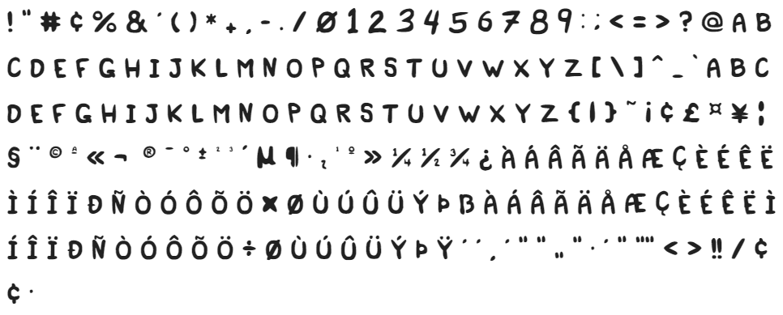
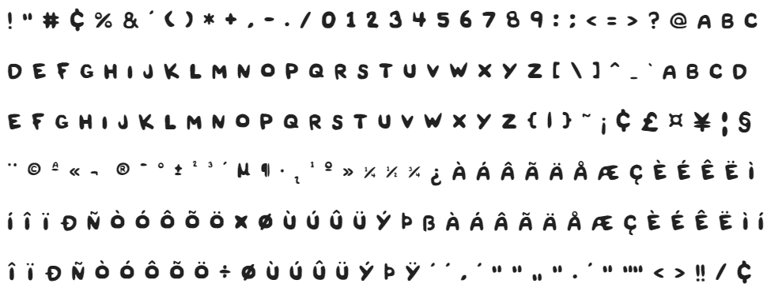

# font-souls

A replica of the Binding of Isaac: Four souls card font.

It is a merged version of two existing fonts.

The merge was done in https://www.calligraphr.com/, you just have to upload the templates.

## Title

## Body

## Attributions:

- Original Font for the game, by [Edmund McMillen](https://twitter.com/edmundmcmillen)
- [Common English characters](https://1drv.ms/u/s!AtLmVOLGzZ2oq3rk4jKqLayq108J?e=DdFZcU) by Locke @ Four Souls discord.
- Portuguese characters and accent marks by [/u/joaofelipenp](https://www.reddit.com/r/FourSouls/comments/an9myu/font_for_custom_cards/)
- Me, for merging [/u/joaofelipenp](https://www.reddit.com/r/FourSouls/comments/an9myu/font_for_custom_cards/)'s version with [Locke](https://1drv.ms/u/s!AtLmVOLGzZ2oq3rk4jKqLayq108J?e=DdFZcU)'s and paying $8(that ended up being R$34) to use all glyphs on https://www.calligraphr.com/.
